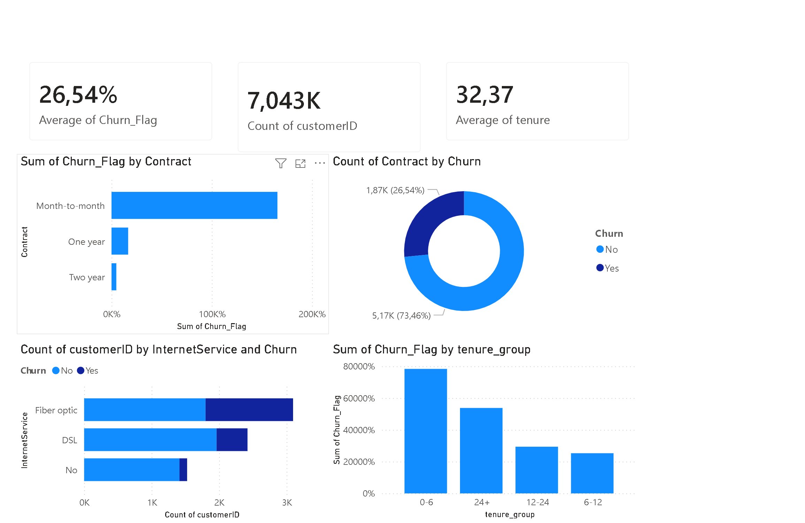

# Customer Churn Analysis
## Dashboard Preview

``
## Overview
This project analyzes customer churn using Python and Power BI. The aim is to identify key factors that contribute to customer churn and provide insights that can help businesses improve customer retention.

## Tools & Technologies
- Python (Pandas, NumPy, Matplotlib, Seaborn)
- Power BI
- GitHub

---

## Dataset
The dataset used in this project:
- **WA_Fn-UseC_-Telco-Customer-Churn.csv**

It contains customer demographic details, services subscribed, and churn status.

---

## Project Components

### 1. Python Analysis
- Data loading and exploration
- Data cleaning and transformation
- Creation of `Churn_Flag`
- KPI calculations:
  - Churn Rate
  - Total Customers
  - Churned Customers
  - Average Tenure

---

### 2. Power BI Dashboard
An interactive dashboard was created to visualize churn insights:

#### Key KPIs
- Churn Rate: **26.54%**
- Total Customers: **7043**
- Average Tenure: **~32 months**

 Customer_Churn_Dashboard.png

#### Visualizations
- Churn by Contract
- Customer Distribution by Churn
- Churn by Internet Service (stacked bar)
- Churn by Tenure Group

---

## Key Insights
- Customers on **month-to-month contracts** have the highest churn rate.
- **Fiber optic users** show higher churn compared to other services.
- Customers with **short tenure (0–6 months)** are more likely to churn.
- A significant portion of customers (≈26%) leave the service.

---

## Files in this Repository
- `Customer_Churn_Analysis.ipynb` → Python notebook  
- `Customer_Churn_Analysis.pbix` → Power BI dashboard  
- `Customer_Churn_Dashboard.png` → Dashboard screenshot  
- `WA_Fn-UseC_-Telco-Customer-Churn.csv` → Dataset  

---

## Conclusion
This analysis provides insights into customer behavior and highlights areas where businesses can focus their retention strategies, such as improving customer experience for new users and offering better contract options.

---

## 🙌 Author
**Kelebogile Aphane**
